<div align="center">


[](#)



<br/>

[](manifest.json)
[](#the-format)
[](../../actions/workflows/validate.yml)
[](https://github.com/A-Theme/Theme-App/blob/main/romm-theme-editor.html)
[](tools/spritesheet-maker)
[](LICENSE)

</div>

---

Themes for the **RomM Switch client** — recolour it, give it a background, its
own font, mascot art, and music. A theme is a folder on the SD card, and the
smallest useful one is a single file.

This is where the A-Theme project's theming work happens now. The older
[Tinfoil](https://github.com/A-Theme/Tinfoil-Themes) side is stable and still
served, but the RomM client does far more with a theme — and everything here is
validated in CI against the rules the client itself enforces.

<div align="center">

<!-- SCREENSHOTS:START -->
<div align="center">


</div>
<!-- SCREENSHOTS:END -->

</div>

## Install a theme

1. Download the theme's folder from [`themes/`](themes/).
2. Copy the **whole folder** to your SD card:

   ```
   sdmc:/switch/romm-client/themes/<Theme Name>/
   ```

3. Launch the client and pick it in **Settings → Theme**.

The folder name is the theme's identity, so keep it intact — renaming it
deselects the theme. Everything else about a theme lives inside its folder;
nothing is installed anywhere else and nothing outside that folder is touched.

## What a theme looks like

```
themes/Midnight Borb/
    theme.json          required - colours and settings
    bg.png              optional - 1280x720 background
    font.ttf            optional - replaces the UI font
    mascot.png          optional - replaces the mascot
    song.mp3            optional - looping music
```

The smallest valid theme is one file:

```json
{
  "name": "Just Blue",
  "author": "you",
  "colors": { "accent": "#4488FF" }
}
```

Anything a theme does not mention keeps the client's built-in value, so you can
tint one thing without restating the other eighteen colours.

## Themes here

See [`manifest.json`](manifest.json) for the machine-readable index — it is
generated, one entry per theme, with what each one changes and how big it is.

## Make one without writing JSON

There is a visual editor for this format:
**[RomM Theme Editor](https://github.com/A-Theme/Theme-App/blob/main/romm-theme-editor.html)**
(in [Theme-App](https://github.com/A-Theme/Theme-App) — runs in a browser,
installs as an app, works offline).

It previews the real client screens at the console's actual 1280×720, checks
your colours for readability, shows the animated-background memory budget live,
and exports either a `theme.json` or a ready-to-drop `.zip` pack.

Worth using even if you are comfortable with JSON, for two reasons it can catch
and a text editor cannot: whether `focus_ring` is actually visible against the
card it outlines, and whether an animated background fits in the texture budget.

## Make an animated background

A sprite sheet is the cheap way to animate a background, but it has to be laid
out exactly the way the client reads it, and a sheet hand-cropped in an image
editor usually is not. **[`tools/spritesheet-maker`](tools/spritesheet-maker)**
builds one:

```bash
cd tools/spritesheet-maker
pip install -r requirements.txt
python3 launcher.py                    # opens http://127.0.0.1:8753 in your browser
```

Or skip Python entirely — the [latest release](../../releases/latest) carries
two downloads per platform:

| download | what it is |
|---|---|
| `spritesheet-maker-<os>-with-ffmpeg.zip` | **the one to take.** Unzip, run it, done — ffmpeg is in the folder, so video input and WebM export work with nothing installed. |
| `spritesheet-maker-<os>` | ~20 MB instead of ~80 MB, for when ffmpeg is already on your machine or you only need GIF, APNG and stills. |

Double-click it and the page opens; the black console
window it leaves behind is how you close it again. The app uses whatever ffmpeg it finds on PATH, and otherwise the one sitting in
its own folder — which is why the bundled zip needs no setup. Without ffmpeg at
all it still does GIF, APNG, animated WebP, stills, every sheet and slice
operation, and GIF/APNG/ZIP export; the page says what is missing, links the
download, and picks it up when you click **Check again**, no restart.

Drop in a GIF, an MP4/WebM, an animated WebP or APNG, or a single still image.
The sheet, a playable preview and the matching `theme.json` are built as soon as
the file lands — the settings are there to adjust a result you can already see,
not a form to fill in first. It runs entirely on your own machine; nothing is
uploaded anywhere.

What makes it worth using rather than a generic packer:

- **It packs the way the client reads.** The client slices
  `cols = sheet_w / frame_width` from the top-left corner, so a sheet with
  padding between cells or an outer margin misaligns every frame after the
  first. **Tune layout for RomM** sets the frame size, zeroes padding and
  margin, and picks a grid with no spare cells.
- **It tells you what the client will refuse** before the console does: the
  48 MB texture budget (320×180 gives you 218 frames, 640×360 gives you 54,
  720p gives you 13), the 240-frame and 60 fps ceilings, a cell that is not 16:9
  and would be stretched, and a frame count the sheet cannot hold.
- **It checks the frames for brightness**, the same way
  [`scripts/validate-themes.py`](scripts/validate-themes.py) does — `dim` is
  tuned against the still image, but the frames are what your text sits on.
- **It writes the `theme.json` block from the sheet it just packed**, so the
  numbers describe the file rather than your intentions.

It also slices an existing sheet back into frames and plays them, and exports a
frame set as GIF, WebM, APNG or a zip of PNGs — so it doubles as a way to check
a sheet someone sent you.

There is a still-image mode too: pan, rotate, pulse, mirror, bounce or fade a
single image into an N-frame loop, for when you want motion and have one piece
of art.

Two themes here already use a sheet, if you want something to compare against or
to open in the slicer: [`themes/Pulse`](themes/Pulse) and
[`themes/Overdrive`](themes/Overdrive).

## Contributing a theme

Read [CONTRIBUTING.md](CONTRIBUTING.md). The short version:

```bash
mkdir -p "themes/My Theme"
$EDITOR "themes/My Theme/theme.json"
./scripts/validate-themes.py          # validates and updates manifest.json
```

CI runs the same validator on every pull request, so a typo'd colour role or a
background you forgot to commit is caught before it reaches anyone's console.

## The format

The full format reference is [`docs/THEME-FORMAT.md`](docs/THEME-FORMAT.md) —
a copy of the client's own theme documentation, kept here so theme authors have
it to hand. `source/ui/theme_spec.h` in the client is the normative
implementation this repo validates against.

<div align="center">



</div>

Quick reference:

| block | what it sets |
|---|---|
| `colors` | 19 semantic roles, CSS hex (`#RGB`, `#RRGGBB`, `#RRGGBBAA`) |
| `background` | still image, `dim`, free `motion`, or a frame `animation` |
| `font` | a `.ttf`/`.otf` replacing the UI face at all sizes |
| `assets` | `mascot` art |
| `audio` | `bgm` track and `volume`; `"bgm": "none"` for silence |

Two things worth knowing before you build something ambitious:

- **Animated backgrounds are budgeted.** One 720p frame is 3.6 MB of texture,
  so there is a 48 MB ceiling. A **sprite sheet** (`"kind": "sheet"`) is one
  texture no matter how many frames and is the cheap path; an animated GIF is
  billed at full screen per frame, and 30 frames already busts the budget.
  Always ship a still `image` as the fallback.
  [`tools/spritesheet-maker`](tools/spritesheet-maker) packs the sheet and works
  the budget out for you.
- **`motion` is free.** Drift, pan or zoom on a still image costs no extra
  memory at all and often looks better than a short loop.

## Part of the A-Theme project

| repo | what it is | |
|---|---|---|
| **RomM-Themes** | you are here — themes for the RomM Switch client | **active** |
| [`tools/spritesheet-maker`](tools/spritesheet-maker) | builds the animated backgrounds in this repo | **active** |
| [Theme-App](https://github.com/A-Theme/Theme-App) | the visual editors — [the RomM one](https://github.com/A-Theme/Theme-App/blob/main/romm-theme-editor.html) is the one for this format | active |
| [Tinfoil-Themes](https://github.com/A-Theme/Tinfoil-Themes) | the Tinfoil theme database, a separate and older format | stable |
| [Switch-Theme-Installer](https://github.com/A-Theme/Switch-Theme-Installer) | on-console installer for Tinfoil themes | stable |
| [A-Theme](https://github.com/A-Theme) | the org | |

## Licence

Theme metadata and this repo's tooling: MIT (see [LICENSE](LICENSE)).

Individual themes may bundle fonts, music and artwork under their own terms —
each theme's `theme.json` credits its author. **Only submit assets you have the
right to redistribute.** Fonts and music are the usual traps: plenty of both
are free to *use* but not to *bundle and redistribute*.

<div align="center">

<br/>

[](https://github.com/A-Theme)
[](https://github.com/A-Theme/Theme-App)
[](https://github.com/A-Theme/Tinfoil-Themes)


</div>
